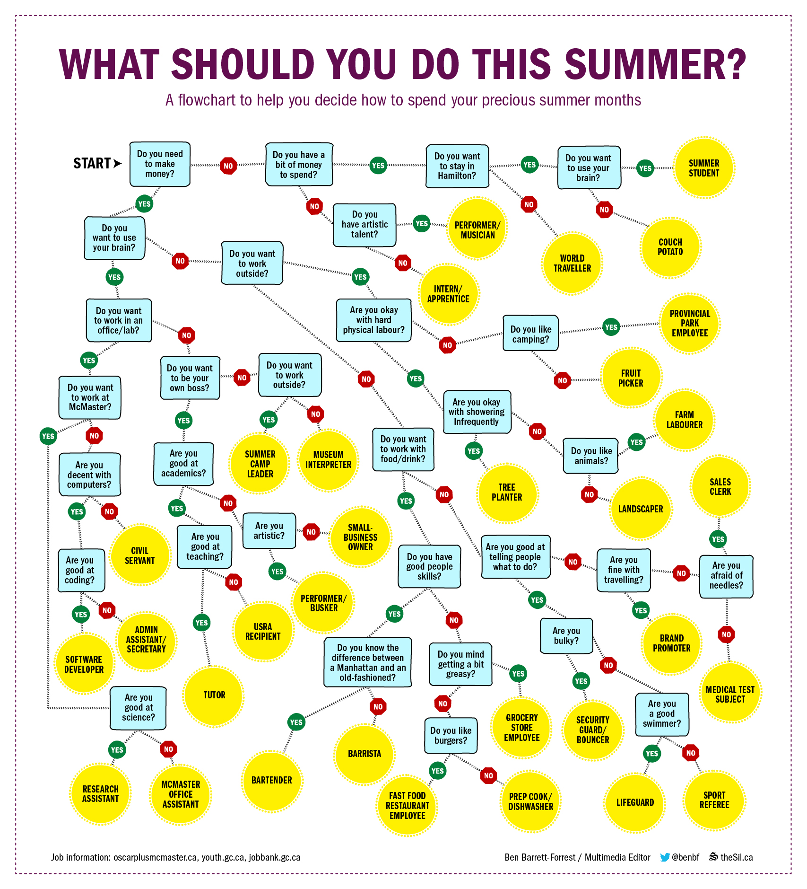

# SummerJobFinder
Projekt na przedmiot pt: "Sztuczna Inteligencja" w formie Java GUI wspomagający wybór pracy na okres letni.

Praca została stworzona przez:
* Remigiusz Janicki (155904)
* Wojciech Gunia (155855)

### Tworząc aplikację bazowaliśmy na logice CLIPS oraz poniższym diagramie decyzyjnym:

